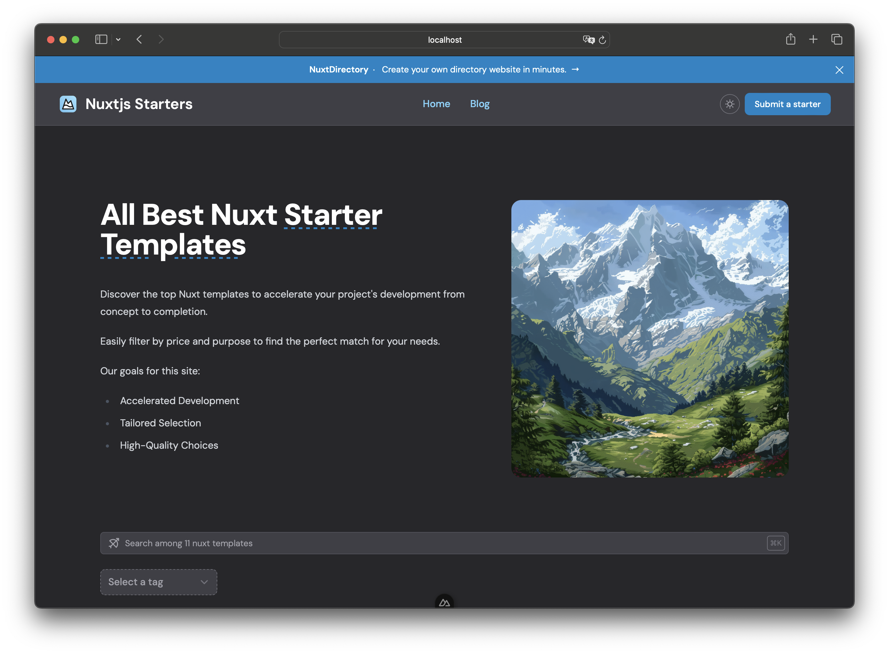

<h1 style="text-align: center">Minted Directory 📚</h1>




<div style="text-align: center;">
  <a href="https://nuxtdirectory.netlify.app/">demo 🍫</a>
</div>

---

Minted directory is a markdown based directory website template. This template is based on [nuxt](https://nuxt.com/).

Make your own directory website by customizing markdown pages.

Each markdown page located in the `content/dir` folder represents a business, tool or listing that you want to display on your directory website.

## What is a directory website?

A directory website is a very common and easy business model to start.

A directory website is designed to organize and display a categorized list of businesses, services, products, or other resources.

These websites function as comprehensive databases, allowing users to search for and find specific entities based on various criteria like location, category, or other attributes.

**Potential Sources of Revenue for directory websites are:**
1. 💸 Listing Fees
2. ⭐ Featured Listings
3. 🪦 Advertising
4. 🎏 Affiliate Marketing
5. 🎣 Lead Generation
6. 📨 Subscription Services
7. #️⃣ Data Sales
8. 📅 Events and Webinars
9. 🌏 E-commerce Integration

## Setup

1. Check out `.demo/` to see an example project.
2. Create a new nuxt project with `npx nuxi@latest init my-directory`
3. Add `nuxt-directory` as a layer in `nuxt.config.ts`:

```ts
export default defineNuxtConfig({
  extends: 'github:masterkram/nuxt-directory',
  devtools: { enabled: true },
});
```


## Deployment

Build the application for production:

```bash
# npm
npm run build

# pnpm
pnpm run build

# yarn
yarn build

# bun
bun run build
```

Locally preview production build:

```bash
# npm
npm run preview

# pnpm
pnpm run preview

# yarn
yarn preview

# bun
bun run preview
```

Check out the [deployment documentation](https://nuxt.com/docs/getting-started/deployment) for more information.
